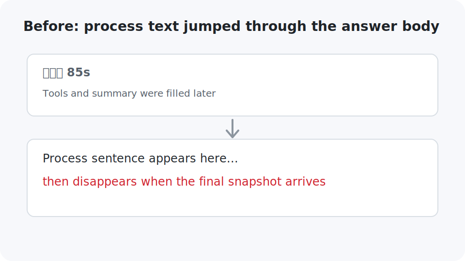
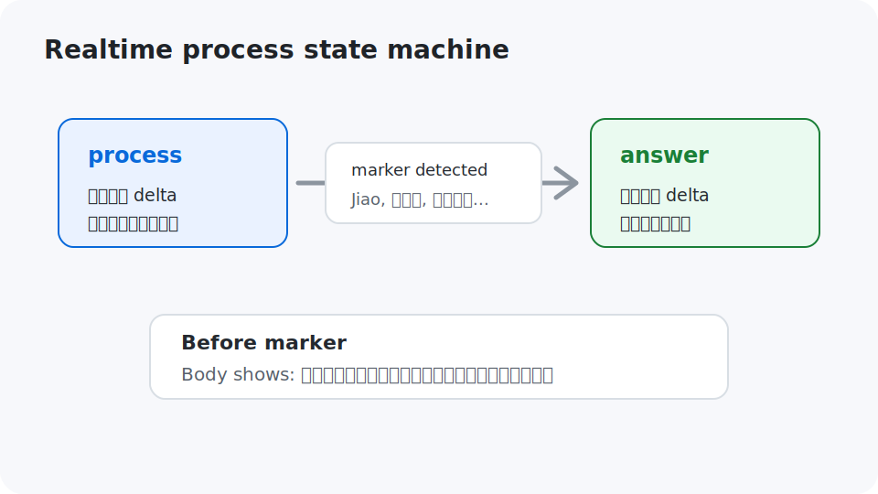
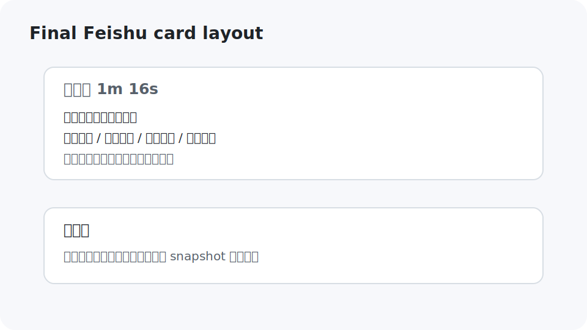

# Yuan Feishu 0.2.3 · Realtime Process Cards

This update makes Feishu reply cards behave closer to Codex Desktop:

- public process text streams into the `已处理 ...` panel as it arrives
- the answer body stays in a friendly in-progress state before the final answer starts
- when a final-answer marker appears, the card switches to answer streaming
- final snapshots only reconcile the final answer and keep the process record intact
- tool calls, memory preflight, and process notes now live in one timeline instead of separate panels

## Before



Process text used to appear in the body while Codex was still thinking, then disappear when the final snapshot replaced the body.

## State Machine



Each reply card now tracks `streamPhase`:

- `process`: route public process deltas into the processed panel
- `answer`: route answer deltas into the body

The bridge switches from `process` to `answer` when it sees a final-answer marker such as `Jiao，弄好了`, `结论是`, or `先说结论`.

## Final Card Shape



The card now keeps a single process timeline:

- public process text
- memory preflight status
- tool call trace
- command/file activity

The body starts with:

```text
我正在认真处理这轮内容，结果会在这里流式出来。
```

Then it switches to streaming the final answer.

## Validation

```bash
npm run check
node scripts/test-card-reply-content.js
node scripts/test-assistant-markdown.js
node scripts/test-approval-policy.js
```
